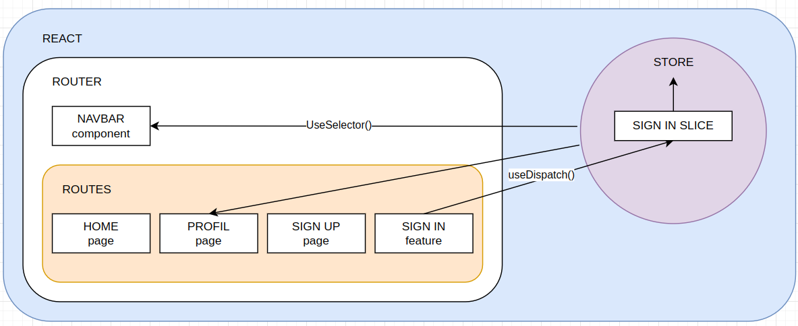

# EXPRESS + DB


```
mkdir users
cd users
touch app.js
npm init -y
npm install express
npm install nodemon --save-dev
npm i dotenv
npm i mysql2
```

_package.json_

```js
"main": "app.js",
  "scripts": {
    "start": "node app.js",
    "dev": "nodemon app.js",
    "test": "echo \"Error: no test specified\" && exit 1"
  }, ...
```

```
mysql> mysql -u <username> -p
mysql> create database shop;
mysql> use shop;
mysql> create table users (id INT PRIMARY KEY AUTO_INCREMENT NOT NULL, first_name VARCHAR(255) NOT NULL, last_name VARCHAR(255) NOT NULL, email VARCHAR(255) NOT NULL, created_at DATE NOT NULL, updated_at DATE NOT NULL, is_admin BOOLEAN NOT NULL);
```

```
git init
```

create .env and .gitignore <br />
_.gitignore_

```js
node_modules.env;
```

_.env_

```
PORT = REPLACE_YOUR_SERVER_PORT
DB_HOST = REPLACE_YOUR_HOST
DB_PORT = REPLACE_YOUR_DB_PORT
DB_USER = REPLACE_YOUR_DB_USER
DB_PASSWORD = REPLACE_YOUR_DB_PASSWORD
DB_NAME = REPLACE_YOUR_DB_NAME
```

```
npm install @faker-js/faker --save-dev
```

# REACT



```
shop-react-express$ npm create vite@latest client -- --template react
shop-react-express/client$ npm install
```

_shop-react-express/.gitignore_

```
./client/node_modules
node_modules
.env
```

```
shop-react-express/client$ npm i bootstrap
shop-react-express/client$ npm i reactstrap react react-dom
shop-react-express/client$ npm i react-icons
```

https://reactstrap.github.io/?path=/story/home-installation--page
https://react-icons.github.io/react-icons/

```
shop-react-express/client$ npm i react-router-dom
```
# CORS 
I add the prefix "api" to the route users in app.js of express
```
app.use("/api/users", userRouter);
```
to say, that "/" is my application express and to make things more clear - all the routes which starts with "/api/..." will send and recieve json to and from react vite.

In react I add "proxy section in *shop-react-express/client/vite.config.js*
with this prefix and the address of express server to say that any request what starts with "api" should be forwarded to localhost:5000. But the browser will think that is still a part of react app.
```
export default defineConfig({
  server: {
    proxy: {
      "/api" : "http://localhost:5000",
    },
  },
  plugins: [react()],
});
```
So in my fetch *shop-react-express/client/features/signUp/SignUp.jsx* I use the address which starts with /api which will find the address in proxy of *vite.config.js*
```
const postUser = async () => {
      const sendUser = await fetch('/api/users/signup',{
        method: "POST",
        body: JSON.stringify(toSend),
        headers: {
          "Content-Type": "application/json",
        },
      });
      ...
}
```
