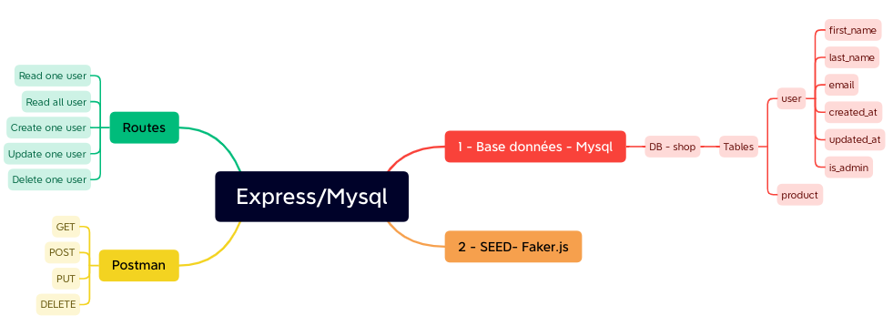

```
mkdir users
cd users
touch app.js
npm init -y
npm install express
npm install nodemon --save-dev
npm i dotenv
npm i mysql2
```
_package.json_

```js
"main": "app.js",
  "scripts": {
    "start": "node app.js",
    "dev": "nodemon app.js",
    "test": "echo \"Error: no test specified\" && exit 1"
  }, ...
```

```
mysql> mysql -u <username> -p
mysql> create database shop;
mysql> use shop;
mysql> create table users (id INT PRIMARY KEY AUTO_INCREMENT NOT NULL, first_name VARCHAR(255) NOT NULL, last_name VARCHAR(255) NOT NULL, email VARCHAR(255) NOT NULL, created_at DATE NOT NULL, updated_at DATE NOT NULL, is_admin BOOLEAN NOT NULL);
```

```
git init
```

create .env and .gitignore <br />
*.gitignore*
```js
node_modules
.env
```
*.env*
```
PORT = REPLACE_YOUR_SERVER_PORT
DB_HOST = REPLACE_YOUR_HOST
DB_PORT = REPLACE_YOUR_DB_PORT
DB_USER = REPLACE_YOUR_DB_USER
DB_PASSWORD = REPLACE_YOUR_DB_PASSWORD
DB_NAME = REPLACE_YOUR_DB_NAME
```
```
npm install @faker-js/faker --save-dev
```